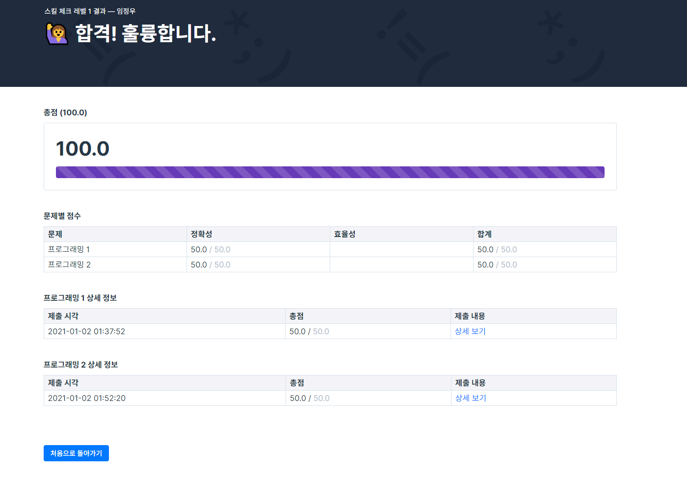

# Homework 1 (ProgrammersCompiler Level 1)
## Skill check Level 1 결과 캡쳐

## Source Code
- 1번 문제 : 문자열 안에서 두 문자들 개수 비교
```java
package Homework.Day01.ProgrammersLevel1.solution1_compareCharCnt;

class Solution {
    boolean solution(String s) {
        boolean answer = false;

        int pCnt = 0;
        int yCnt = 0;

        for(int i = 0; i < s.length(); i++){
            if(s.charAt(i) == 'p' || s.charAt(i) == 'P'){
                pCnt++;
            } else if(s.charAt(i) == 'y' || s.charAt(i) == 'Y'){
                yCnt++;
            }
        }

        if((pCnt + yCnt == 0) || pCnt == yCnt){
            answer = true;
        }

        return answer;
    }
}
```
</code></pre>
- 2번 문제 : 정해진 index 기준으로 문자열 정렬
```java
package Homework.Day01.ProgrammersLevel1.solution2_sortingBasedIndex;

import java.util.Arrays;
import java.util.Comparator;

class Solution {
    public String[] solution(String[] strings, int n) {

        String[] answer = {};

        answer = strings;

        Arrays.sort(answer, new Comparator<String>() {
            @Override
            public int compare(String o1, String o2) {
                return o1.charAt(n) - o2.charAt(n) != 0 ? o1.charAt(n) - o2.charAt(n) : o1.compareTo(o2);
            }
        });

        return answer;
    }
}
```

